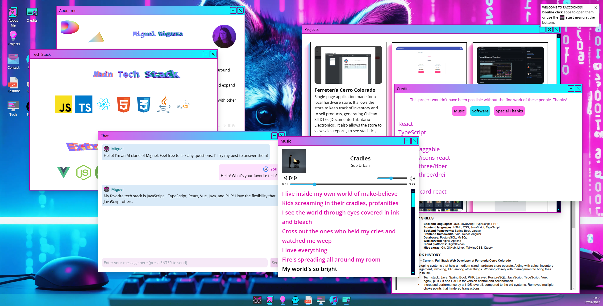
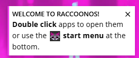
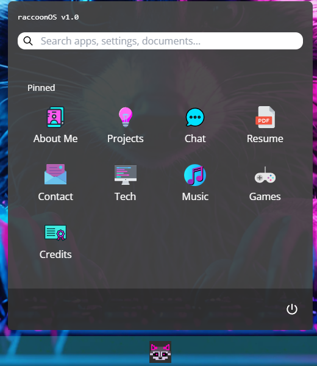

# raccoonOS

My personal website and portfolio that resembles a desktop operating system.



Built with React + TypeScript.

## How to run

First, install NodeJS if not already installed.

Run `npm install` and then `npm run dev` to start the development server.

## How it works

The website is easy to make with a basic knowledge of React even though the result looks great in my opinion.

### Desktop

The website wraps mostly everything inside a `Desktop` component. This component contains all the application states and handles their actions like opening, closing, and minimizing them. It is also responsible for handling the `StartMenu` component.

### Mobile warning

The website is only viewable in a computer because it simulates a desktop OS. If visited on a mobile device a warning is displayed and the user is asked to please visit the website using a computer.

### WindowStore

This is a zustand store that handles z-indices of windows, so it keeps track of the latest one and always display newly opened apps at the top.

### AppIcons and hyperlinks

Application icons have a predefined position and they can be freely moved by dragging them around like in a real OS. The app supports both `hyperlinks` and application icons (`AppIcon`s), the difference is that `hyperlinks` only open a link in a new tab, while application icons open a window containing the app. Currently, the only hyperlink is one that takes the user to the GitHub repository (this website).

When double clicking an `AppIcon`, the application is opened if it was closed. If the application was opened it gets moved to the top (highest z-index).

### Windows

Windows contain all applications' contents.

These are the Window props:

```typescript
export interface WindowProps {
  name: string; // Name shown on the top of the app
  appName: string; // Internal app name
  width: number; // Window width
  height: number; // Window height
  isOpen: boolean; // If true the window is shown in the task bar and also in the desktop if isHidden is false
  isHidden: boolean; // If true the window isn't shown in the desktop (display: hidden)
  handleClose: () => void; // Gets triggered when clicking the close icon
  handleHide: () => void; // Gets triggered when clicking the minimize icon
  zIndex: number; // Stores the window's current z-index
  nonResizable: boolean; // If true window cannot be resized
}
```

### Applications

Applcations just render a Window with all the app's contents (what was mentioned earlier). This is an example:

```typescript
import classes from './ContactApplication.module.css';
import Window from '../../Window/Window';
import { WindowProps } from '../../../shared/WindowProps';
import { IconBrandGithub, IconBrandLinkedin } from '@tabler/icons-react';

const ContactApplication = ({ winProps }: { winProps: WindowProps }) => {
  return (
    winProps.isOpen && (
      <Window
        name="Contact me"
        isHidden={winProps.isHidden}
        handleClose={winProps.handleClose}
        handleHide={winProps.handleHide}
        width={800}
        height={800}
        appName={winProps.appName}
        zIndex={winProps.zIndex}
        nonResizable
      >
        <div className={classes.window}>
          <h1>
            Have an interesting idea? A job offer? Just want to reach out to me?
          </h1>
          <p>Email me at</p>
          <a href="mailto:me@miguelhiguera.dev">me@miguelhiguera.dev</a>

          <p>You can also find me at:</p>
          <div className={classes.links}>
            <a target="_blank" href="https://github.com/miguelhigueradev">
              <IconBrandGithub />
            </a>
            <a
              target="_blank"
              href="https://www.linkedin.com/in/miguelhigueradev/"
            >
              <IconBrandLinkedin />
            </a>
          </div>
        </div>
      </Window>
    )
  );
};

export default ContactApplication;
```

All applications are stored in the `apps.ts` file so it's easy to add a new one by following the provided format.

This is a list of all the implemented applications:

#### About me

Just displays a bit of information about me.

#### Projects

Displays a showcase of some of the projects I've worked on.

#### Contact

Displays contact information and social media websites.

#### AI Chat

Allows the user to chat with an AI that can answer questions about me (like my tech stack, projects, hobbies, etc.) and technology topics. Chat messages are stored in a `ChatStore` to persist them even when the window is closed.

#### Resume

Displays my resume as a PDF embedded in an iframe.

#### Tech (stack)

Displays my main technology stack.

#### Music

Contains a music player that has three tracks. It has synchronized lyrics.

#### Discord

Shows my Discord profile card with my current status, showing the game I'm playing or music I'm listening to. (currently hidden to improve this application).

#### Credits

Shows all the music and technologies used to make the website, besides some special thanks.

#### Source

Just a hyperlink that redirects to this website.

#### (Recommended) games

A list of some of my favorite video games.

### Notifications

There is a notifications system built-in using a `NotificationStore`. This is the notification interface:

```typescript
interface Notification {
  id: string;
  title: string;
  message: ReactNode;
}
```

To add a new notification, initialize the store's `addNotification()` method:

```typescript
import NotificationStore from './stores/NotificationStore';
// your code...
const { addNotification } = NotificationStore();
```

And call it:

```typescript
addNotification(
  'welcome-notification', // ID
  'Welcome to RaccoonOS!', // Notification title
  // Notification contents (just any JSX)
  <>
    <strong>Double click</strong> apps to open them or use the
    
    <strong>start menu</strong> at the bottom.
  </>
);
```

Notifications are displayed in the top right corner of the screen:



### Start menu

The start menu is an alternative way of opening apps. It works exactly the same as opening them by double clicking but it is more accesible because it doesn't require a double click to open them.



### Easter eggs

There is an easter egg if you press the Konami Code. This is handled by using a `useKonamiCode` custom React hook that detects when a key combination is entered and triggers a callback. The code can be customized to your needs.

## Complete tech stack + libraries

- **TypeScript**: The programming language used to make the website
- **React**: Front-end library used to make all the components, writing declarative code that's easier to extend
- **react-draggable**: Library used to quickly and easily implement draggable icons and windows
- **@tabler/icons-react**: Icons used in the `Contact` application
- **three.js**: JavaScript 3D library used to add simple 3d graphics to some applications (and a lot more in the future!)
- **@react-three/fiber**: React renderer for `three.js`
- **@react-three/drei**: Useful helpers for `@react-three/fiber`
- **zustand**: State management library for React to centralize state and avoid excessive prop drilling
- **discord-card-react**: Component thar renders a Discord profile card that syncs with my real Discord status (currently unused)

The chat backend is a just a Next.js application written with TypeScript.

## Contributions

If you think something could be improved or added to the website, feel free to submit an issue.

## Final notes

Thanks for visiting my website and reading this! Even though the website is in a good state, it's not completely finished and I have some applications yet to implement, alongside improving current ones and adding more features.
